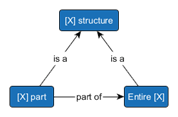
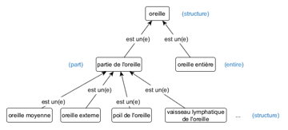

Les règles éditoriales ci-dessous doivent être appliquées aux nouvelles traductions.

Pour les traductions déjà existantes ne respectant pas ces règles, le processus de correction se fera au fur et à mesure des publications et en fonction des ressources disponibles. Vous pouvez utiliser le portail des demandes d'évolution pour demander la modification ou l'ajout concepts ou traductions : [https://rmp.ihtsdotools.org/](https://rmp.ihtsdotools.org/).

Ces règles reprennent celles du *French Translation Collaboration Group* qui ont été reformulées dans un soucis de clarté. Certaines règles ont été modifiées afin de s’aligner avec les choix d’acceptabilité fait par l’ANS.

La colonne « Source » indique la source d’origine de la règle en question :

<ul>
  <li>SI : SNOMED Int., cette règle est dérivée du guide éditorial de l’édition internationale ;</li>
  <li>FTCG : French Translation Collaboration Group, cette règle est dérivée des règles du groupe francophone ;</li>
  <li>ANS : cette règle est une règle spécifique au NRC français.</li>
</ul>

 

    <ul class="js-tablist" data-hx="h2">
        <li class="js-tablist__item">
            <a href="#tabs-01" class="js-tablist__link">Règles génériques</a>
        </li>
        <li class="js-tablist__item">
            <a href="#tabs-02" class="js-tablist__link">Règles spécifiques aux hiérarchies</a>
        </li>
    </ul>
    

        

            <!-- Onglet 1 - Règles génériques -->
            

                <h3 class="js-accordion__header">Abréviations, acronymes et sigles (ab)<svg class="svg-icon svg-angle-down" aria-hidden="true" focusable="false"><use xlink:href="../assets/svg_icons/icon-sprite.svg#angle-down"></use></svg></h3>
                

                    

                        <table>
                            <thead>
                                <tr><th>ID</th><th>Règles</th><th>Source</th><th>Mise à jour</th></tr>
                            </thead>
                            <tbody>
                                <tr>
                                    <td>ab1</td>
                                    <td>
                                        Les abréviations doivent être évitées, sauf si elles sont consacrées par l’usage. 
                                        <u>Exemples</u> : Escherichia spp.</td>
                                    <td>SI</td>
                                    <td>08/04/19</td>
                                </tr>
                                <tr>
                                    <td>ab2</td>
                                    <td>
                                        Les acronymes et les sigles peuvent être utilisés dans les synonymes. Dans ce cas, les majuscules sont conservées mais elles doivent être non accentuées. 
                                        L’acronyme ou le sigle doit être suivi de sa forme développée. Elle est :
                                        
<ul>
                                            <li>Séparée par un trait d’union (UTF8 0x2D) encadré de deux espaces, s’il n’y a pas d’autres mot dans le synonyme ;</li>
                                            <li>Entre parenthèses, si le synonyme contient d’autres mots.</li>
                                        </ul>

                                         
                                        Si l’acronyme ou le sigle est consacré par l’usage, un synonyme sans forme développée peut être créé.  
                                        <u>Exemples</u> :
                                        
<ul>
                                            <li>EIEC - Escherichia coli entéro-invasif</li>
                                            <li>EHEC (Escherichia coli entérohémorragique) sérotype O157:H7</li>
                                            <li>COVID-19</li>
                                        </ul>

                                    </td>
                                    <td>SI</td>
                                    <td>25/11/24</td>
                                </tr>
                                <tr>
                                    <td>ab3</td>
                                    <td>
                                        Les acronymes et sigles courants deviennent des noms communs. Ils s'écrivent alors en minuscules, se mettent au pluriel et entraînent parfois la formation de dérivés c’est-à-dire qu'ils se retrouvent parfois incorporés dans un nouveau mot. 
                                        <u>Exemples</u> : laser, sidéen(ne)
                                    </td>
                                    <td>FTCG</td>
                                    <td>02/07/19</td>
                                </tr>
                            </tbody>
                        </table>
                    

                

                <h3 class="js-accordion__header">Articles (ar)<svg class="svg-icon svg-angle-down" aria-hidden="true" focusable="false"><use xlink:href="../assets/svg_icons/icon-sprite.svg#angle-down"></use></svg></h3>
                

                    

                        <table>
                            <thead>
                                <tr><th>ID</th><th>Règles</th><th>Source</th><th>Mise à jour</th></tr>
                            </thead>
                            <tbody>
                                <tr>
                                    <td>ar1</td>
                                    <td>
                                        Les articles doivent être évités, sauf exception notée dans l’une des règles ci-dessous. 
                                        <u>Exemple</u> : herpès labial
                                    </td>
                                    <td>SI</td>
                                    <td>02/07/19</td>
                                </tr>
                                <tr>
                                    <td>ar2</td>
                                    <td>
                                        Aucun article ne doit figurer en début de terme. 
                                        <u>Exemple</u> : syndrome hépatorénal (et non « le syndrome hépatorénal »)
                                    </td>
                                    <td>FTCG</td>
                                    <td>05/06/23</td>
                                </tr>
                                <tr>
                                    <td>ar3</td>
                                    <td>
                                        Une description mentionnant une structure corporelle unique, doit utiliser l’article défini singulier ou la forme adjectivale si elle est pertinente. 
                                        <u>Exemples</u> : anévrisme du cœur, arrêt cardiaque, brûlure électrique de la peau, inflammation de la bouche, inflammation buccale
                                    </td>
                                    <td>FTCG</td>
                                    <td>28/06/21</td>
                                </tr>
                                <tr>
                                    <td>ar4-FR</td>
                                    <td>
                                        Une description mentionnant une structure corporelle non unique doit utiliser l’article défini singulier ou la forme adjectivale (en fonction de l’usage) si le concept ne précise pas qu'une seule des structures est concernée. 
                                        Elle doit utiliser l'article indéfini singulier si le concept indique qu'une seule des structures est concernée. 
                                        <u>Exemples</u> :
                                        
<ul>
                                            <li><i>Sprain of foot</i> &rarr; entorse du pied</li>
                                            <li><i>Single lung transplant</i> &rarr; greffe d'un poumon</li>
                                            <li><i>MRI of both hands</i> &rarr; IRM des deux mains</li>
                                        </ul>

                                    </td>
                                    <td>ANS</td>
                                    <td>01/08/25</td>
                                </tr>
                                <tr>
                                    <td>ar6</td>
                                    <td>
                                        Aucun article ne doit figurer dans un synonyme désignant un dispositif ou un produit ciblant une partie du corps. 
                                        <u>Exemples</u> : prothèse de hanche, sonde nasale, pommade à lèvres
                                    </td>
                                    <td>FTCG</td>
                                    <td>02/11/20</td>
                                </tr>
                                <tr>
                                    <td>ar7</td>
                                    <td>
                                        L’article défini pluriel doit être utilisé si le terme anglais contient all ou both. 
                                        <u>Exemples</u> :
                                        
<ul>
                                            <li><i>Congenital absence of all fingers</i> &rarr; absence congénitale de tous les doigts</li>
                                            <li><i>Lesion of both ears</i> &rarr; lésion bilatérale des oreilles</li>
                                        </ul>

                                    </td>
                                    <td>FTCG</td>
                                    <td>02/11/20</td>
                                </tr>
                            </tbody>
                        </table>
                    

                

                <h3 class="js-accordion__header">Caractères séparateurs ou de ponctuation (se)<svg class="svg-icon svg-angle-down" aria-hidden="true" focusable="false"><use xlink:href="../assets/svg_icons/icon-sprite.svg#angle-down"></use></svg></h3>
                

                    

                        <table>
                            <thead>
                                <tr><th>ID</th><th>Règles</th><th>Source</th><th>Mise à jour</th></tr>
                            </thead>
                            <tbody>
                                <tr>
                                    <td>se1</td>
                                    <td>
                                        La virgule peut être utilisée dans deux cas en dehors du rôle de séparateur :
                                        
<ul>
                                            <li>Pour énumérer</li>
                                            <li>Pour introduire une précision si elle ne peut être intégrée sans ponctuation ou si une syntaxe compacte est souhaitée</li>
                                        </ul>

                                         
                                        <u>Exemples</u> :
                                        
<ul>
                                            <li>colite, entérite et gastroentérite infectieuses</li>
                                            <li>maléate de diltiazem 219 mg et maléate d'énalapril 5 mg, comprimé oral</li>
                                        </ul>

                                         
                                        Dans ces deux cas, la virgule doit respecter les règles de typographie française.  
                                        Le second cas est retenu pour la description des médicaments virtuels ou si l’absence de virgule engendre une lourdeur excessive.  
                                        <u>Exemple où la virgule est évitée dans le second cas</u> : <i>Anesthesia for renal transplant, recipient</i> &rarr; anesthésie du receveur pour greffe rénal.
                                    </td>
                                    <td>FTCG</td>
                                    <td>05/06/23</td>
                                </tr>
                                <tr>
                                    <td>se2</td>
                                    <td>
                                        La barre oblique sans espace peut être utilisée dans l’expression « et/ou » qui traduit <i>and/or</i>. 
                                        <u>Exemple</u> : <i>Structure of skin and/or mucous membrane</i> &rarr; peau et/ou muqueuse
                                    </td>
                                    <td>FTCG</td>
                                    <td>02/11/20</td>
                                </tr>
                                <tr>
                                    <td>se3</td>
                                    <td>
                                        La barre oblique sans espace peut être utilisée comme barre de fraction. 
                                        <u>Exemples</u> :
                                        
<ul>
                                            <li>mg/L (milligrammes par litre)</li>
                                            <li>tube sous vide avec citrate de sodium 1/4 pour prélèvement sanguin</li>
                                        </ul>

                                    </td>
                                    <td>FTCG</td>
                                    <td>08/04/19</td>
                                </tr>
                                <tr>
                                    <td>se4</td>
                                    <td>La barre oblique utilisée pour représenter une alternative dans la description en anglais doit être remplacée par « ou ».</td>
                                    <td>FTCG</td>
                                    <td>05/06/23</td>
                                </tr>
                                <tr>
                                    <td>se5</td>
                                    <td>
                                        Le double point collé sans espace peut être utilisé pour caractériser un sérotype ou un variant. 
                                        <u>Exemple</u> : Escherichia coli de sérotype O103:H1
                                    </td>
                                    <td>FTCG</td>
                                    <td>08/04/19</td>
                                </tr>
                                <tr>
                                    <td>se6</td>
                                    <td>
                                        Le double point encadré par deux espaces peut remplacer une préposition pour introduire une précision de manière concise. 
                                        <u>Exemples</u> : antécédents familiaux : goutte  
                                        Le double point encadré par deux espaces peut introduire le résultat d’une observation dans la hiérarchie <i>Clinical finding</i>. 
                                        <u>Exemples</u> : sang occulte dans les selles : traces
                                    </td>
                                    <td>FTCG</td>
                                    <td>05/06/23</td>
                                </tr>
                                <tr>
                                    <td>se7</td>
                                    <td>
                                        Le tiret simple (UTF8 0x2D) encadré par deux espaces doit être uniquement utilisé pour introduire la forme développée d’acronymes ou de sigles. 
                                        <u>Exemples</u> :
                                        
<ul>
                                            <li>TDAH – trouble déficitaire de l’attention avec hyperactivité</li>
                                            <li>BPCO – bronchopneumopathie chronique obstructive</li>
                                        </ul>

                                    </td>
                                    <td>FTCG</td>
                                    <td>02/11/20</td>
                                </tr>
                                <tr>
                                    <td>se8</td>
                                    <td>Le tiret simple (UTF8 0x2D) peut être utilisé comme trait d’union dans un mot composé.</td>
                                    <td>FTCG</td>
                                    <td>02/11/20</td>
                                </tr>
                                <tr>
                                    <td>se9</td>
                                    <td>Les parenthèses doivent être utilisées pour encadrer la forme développée d’un acronyme ou d’un sigle au sein d’une description plus vaste. Les règles de typographie    françaises sont respectées.</td>
                                    <td>FTCG</td>
                                    <td>05/06/23</td>
                                </tr>
                                <tr>
                                    <td>se10</td>
                                    <td>
                                        Seul le caractère « ' » (UTF8 0x27) doit être utilisé pour l’apostrophe. 
                                        <u>Exemple</u> : lipome de l'épaule
                                    </td>
                                    <td>FTCG</td>
                                    <td>05/04/23</td>
                                </tr>
                                <tr>
                                    <td>se11</td>
                                    <td>
                                        Les synonymes ne doivent pas se terminer par un point (UTF8 0x2E), sauf exception. 
                                        <u>Exemple d’exception</u> : Candida spp.
                                    </td>
                                    <td>SI</td>
                                    <td>18/12/23</td>
                                </tr>
                            </tbody>
                        </table>
                    

                

                <h3 class="js-accordion__header">Lettres grecques (gr)<svg class="svg-icon svg-angle-down" aria-hidden="true" focusable="false"><use xlink:href="../assets/svg_icons/icon-sprite.svg#angle-down"></use></svg></h3>
                

                    

                        <table>
                        <thead>
                            <tr><th>ID</th><th>Règles</th><th>Source</th><th>Mise à jour</th></tr>
                        </thead>
                        <tbody>
                            <tr>
                                <td>gr1</td>
                                <td>
                                    Les lettres grecques doivent être écrites sous leur forme longue. 
                                    <u>Exemples</u> :
                                    
<ul>
                                        <li><i>Beta alanine</i> &rarr; bêta alanine</li>
                                        <li><i>Alpha fetoprotein</i> &rarr; alpha-fœtoprotéine</li>
                                    </ul>

                                </td>
                                <td>FTCG</td>
                                <td>05/06/23</td>
                            </tr>
                        </tbody>
                        </table>
                    

                

                <h3 class="js-accordion__header">Lettres ligaturées (ll)<svg class="svg-icon svg-angle-down" aria-hidden="true" focusable="false"><use xlink:href="../assets/svg_icons/icon-sprite.svg#angle-down"></use></svg></h3>
                

                    

                        <table>
                            <thead>
                                <tr><th>ID</th><th>Règles</th><th>Source</th><th>Mise à jour</th></tr>
                            </thead>
                            <tbody>
                                <tr>
                                    <td>ll1</td>
                                    <td>
                                        Les lettres ligaturées doivent être utilisées à bon escient et avec le bon encodage :
                                        
<ul>
                                            <li>æ – UTF8 0xC3 0xA6 ; (Alt 0230 sous Windows)</li>
                                            <li>Æ – UTF8 0xC3 0x86 ; (Alt 0198 sous Windows)</li>
                                            <li>œ – UTF8 0xC5 0x93 ; (Alt 0156 sous Windows)</li>
                                            <li>ΠРUTF8 0xC5 0x92 ; (Alt 0140 sous Windows)</li>
                                        </ul>

                                         
                                        <u>Exemples</u> : fœtal, œsophage, nævus
                                    </td>
                                    <td>FTCG</td>
                                    <td>02/11/20</td>
                                </tr>
                            </tbody>
                        </table>
                    

                

                <h3 class="js-accordion__header">Noms propres (np)<svg class="svg-icon svg-angle-down" aria-hidden="true" focusable="false"><use xlink:href="../assets/svg_icons/icon-sprite.svg#angle-down"></use></svg></h3>
                

                    

                        <table>
                            <thead>
                                <tr><th>ID</th><th>Règles</th><th>Source</th><th>Mise à jour</th></tr>
                            </thead>
                            <tbody>
                                <tr>
                                    <td>np1</td>
                                    <td>
                                        Les éponymes ou toponymes doivent être évités dans les termes préférés sauf s’ils sont consacrés par l’usage. Dans ce cas, les majuscules sont conservées. 
                                        <u>Exemples</u> :
                                        
<ul>
                                            <li><i>Bell’s palsy</i> &rarr; paralysie de Bell</li>
                                            <li><i>Lyme arthritis</i> &rarr; arthrite de Lyme</li>
                                        </ul>

                                    </td>
                                    <td>SI</td>
                                    <td>02/07/19</td>
                                </tr>
                            </tbody>
                        </table>
                    

                

                <h3 class="js-accordion__header">Rectification orthographiques de 1990 (or)<svg class="svg-icon svg-angle-down" aria-hidden="true" focusable="false"><use xlink:href="../assets/svg_icons/icon-sprite.svg#angle-down"></use></svg></h3>
                

                    

                        <table>
                            <thead>
                                <tr><th>ID</th><th>Règles</th><th>Source</th><th>Mise à jour</th></tr>
                            </thead>
                            <tbody>
                                <tr>
                                    <td>or2</td>
                                    <td>
                                        La graphie doit être en accord avec la prononciation lorsque « é » se prononce « è ». Un synonyme acceptable utilisant l’ancienne orthographe peut être ajouté. 
                                        <u>Exemple</u> :
                                        
<ul>
                                            <li>PT – évènement de la vie</li>
                                            <li>SYN – événement de la vie</li>
                                        </ul>

                                    </td>
                                    <td>FTCG</td>
                                    <td>02/11/20</td>
                                </tr>
                                <tr>
                                    <td>or3</td>
                                    <td>
                                        Dans les mots composés, la soudure doit être privilégiée au trait d’union (UTF8 0x2D) si cela n’entraîne pas de difficultés de lecture (e.g. « génito-urinaire » conserve son trait d’union car la soudure du o et du u crée le phonème « ou »). 
                                        <u>Exemples de soudures</u> : postopératoire, postpartum, contrindication, intracrânien, prénatal, préopératoire, périanal, posttraumatique 
                                        <u>Exemples de conservation du trait d’union</u> : sous-claviculaire, génito-urinaire, intra-utérin, micro-irrigation, anti-inflammatoire, sous-arachnoïdien.  
                                        Un synonyme acceptable utilisant l’ancienne orthographe peut être ajouté. 
                                        <u>Exemple</u> :
                                        
<ul>
                                            <li>PT – chirurgie contrindiquée</li>
                                            <li>SYN – chirurgie contre-indiquée</li>
                                        </ul>

                                    </td>
                                    <td>FTCG</td>
                                    <td>07/10/24</td>
                                </tr>
                                <tr>
                                    <td>or4</td>
                                    <td>
                                        Le trait d’union (UTF8 0x2D) doit être conservé avec les préfixes suivant :
                                        
<ul>
                                            <li>demi-</li>
                                            <li>mi-</li>
                                            <li>semi-</li>
                                            <li>ex-</li>
                                            <li>sous-</li>
                                            <li>vice-</li>
                                            <li>non-</li>
                                        </ul>

                                    </td>
                                    <td>FTCG</td>
                                    <td>02/11/20</td>
                                </tr>
                                <tr>
                                    <td>or5</td>
                                    <td>
                                        Le trait d’union (UTF8 0x2D) coordonnant deux noms propres ou géographiques doit être conservé pour marquer l’égalité des deux noms. 
                                        <u>Exemple</u> : <i>Epstein-Barr virus hepatitis</i> &rarr; hépatite causée par le virus d’Epstein-Barr
                                    </td>
                                    <td>FTCG</td>
                                    <td>02/11/20</td>
                                </tr>
                                <tr>
                                    <td>or6</td>
                                    <td>
                                        L’accent circonflexe disparait sur i et u. Un synonyme acceptable utilisant l’ancienne orthographe peut être ajouté.  
                                        <u>Exemples</u> : <i>burn of neck</i>
                                        
<ul>
                                            <li>PT – brulure du cou</li>
                                            <li>SYN – brûlure du cou</li>
                                        </ul>

                                         
                                        <u>Exemple d'exception</u> : <i>after fasting</i> &rarr; après un jeûne (pour éviter la confusion avec « jeune »)
                                    </td>
                                    <td>FTCG</td>
                                    <td>02/11/20</td>
                                </tr>
                            </tbody>
                        </table>
                    

                

                <h3 class="js-accordion__header">Style général et syntaxe (ss)<svg class="svg-icon svg-angle-down" aria-hidden="true" focusable="false"><use xlink:href="../assets/svg_icons/icon-sprite.svg#angle-down"></use></svg></h3>
                

                    

                        <table>
                            <thead>
                                <tr><th>ID</th><th>Règles</th><th>Source</th><th>Mise à jour</th></tr>
                            </thead>
                            <tbody>
                                <tr>
                                    <td>ss1</td>
                                    <td>
                                        Les synonymes doivent être écrits en minuscules. Par défaut, ils sont insensibles à la casse (ci).  
                                        <u>Exceptions</u> : noms propres, symboles, codes, sigles, acronymes ou taxa comportant des majuscules et/ou des minuscules imposées.  
                                        <u>Exemples</u> : pH, IgG, ADN, Legionella anisa, Epstein-Barr  
                                        <u>Sensibilité à la casse</u> :
                                        
<ul>
                                            <li>Cas général – insensible à la casse (ci)</li>
                                            <li>Exception – sensible à la casse (CS) et seul le premier caractère est insensible à la casse (cI)</li>
                                        </ul>

                                    </td>
                                    <td>SI</td>
                                    <td>02/11/20</td>
                                </tr>
                                <tr>
                                    <td>ss2</td>
                                    <td>
                                        Les synonymes doivent être au singulier excepté si le concept implique un pluriel. 
                                        <u>Exemples</u> :
                                        
<ul>
                                            <li><i>Hospital furniture</i> &rarr; mobilier d’hôpital</li>
                                            <li><i>Breasts asymmetrical</i> &rarr; seins asymétriques</li>
                                            <li><i>Inpatient rehabilitation environment</i> &rarr; environnement de réadaptation pour patient(e)s hospitalisé(e)s</li>
                                        </ul>

                                    </td>
                                    <td>SI</td>
                                    <td>08/04/19</td>
                                </tr>
                                <tr>
                                    <td>ss3</td>
                                    <td>
                                        Les formes adjectivales ou au participe présent doivent :
                                        
<ul>
                                            <li>être privilégiées dans le terme préféré pour favoriser l’économie de mots ;</li>
                                            <li>être d’usage dans le contexte clinique ;</li>
                                            <li>ne pas introduire d’ambiguïté.</li>
                                        </ul>

                                         
                                        <u>Exemples avec forme adjectivale/participe présent</u> :
                                        
<ul>
                                            <li>traumatisme crânien</li>
                                            <li>maladie affectant la grossesse</li>
                                        </ul>

                                         
                                        <u>Exemples avec complément de nom (avec article)</u> :
                                        
<ul>
                                            <li>infarctus de la thyroïde (car « infarctus thyroïdien » n'est pas recensé)</li>
                                            <li>mal de la route (car « mal routier » est incorrect)</li>
                                            <li>arthrite d'une main (car « arthrite manuelle » est incorrect)</li>
                                        </ul>

                                    </td>
                                    <td>FTCG</td>
                                    <td>05/06/23</td>
                                </tr>
                                <tr>
                                    <td>ss4</td>
                                    <td>Les descriptions doivent respecter l'ordre conventionnel des mots en français.</td>
                                    <td>SI</td>
                                    <td>05/06/23</td>
                                </tr>
                                <tr>
                                    <td>ss5</td>
                                    <td>
                                        Le pluriel des mots d’origine latine doit suivre les règles de la nouvelle orthographe. 
                                        <u>Exemple</u> : <i>Number of stimuli</i> &rarr; nombre de stimulus
                                    </td>
                                    <td>FTCG</td>
                                    <td>08/04/19</td>
                                </tr>
                                <tr>
                                    <td>ss6</td>
                                    <td>
                                        Le terme préféré doit contenir des termes épicènes ou, entre parenthèses, la terminaison au féminin des adjectifs, participes ou noms dont l’orthographe varie selon le genre. 
                                        <u>Exemples</u> : amputé(e), diététicien(ne), acupuncteur(-ice), conseiller(e) clinique, travailleur(-se) social(e), clinicien(ne) autorisé(e), professionnel(le) de la santé  
                                        Des synonymes strictement au masculin ou au féminin peuvent être ajoutés pour des questions d'interface. 
                                        Le point médiant n’est pas jugé suffisamment adopté par le groupe pour être utilisé.
                                    </td>
                                    <td>FTCG</td>
                                    <td>23/10/25</td>
                                </tr>
                                <tr>
                                    <td>ss7</td>
                                    <td>
                                        Si un FSN ou un synonyme contient une entité provenant d’une autre hiérarchie (e.g. <i>Body structure</i>, <i>Substance</i>, <i>Organism</i>), les règles éditoriales de ladite hiérarchie doivent s’appliquer à cette entité.  
                                        Si l’entité provient de <i>Body structure</i>, le mot « structure » ne doit pas être utilisé.  
                                        <u>Exemples</u> :
                                        
<ul>
                                            <li>fracture de l’ulna (et non « fracture de la structure osseuse de l’ulna »)</li>
                                            <li>pneumonie causée par Staphylococcus aureus</li>
                                        </ul>

                                    </td>
                                    <td>SI</td>
                                    <td>05/06/23</td>
                                </tr>
                            </tbody>
                        </table>
                    

                

                <h3 class="js-accordion__header">Symboles scientifiques, chiffres et nombres (sc)<svg class="svg-icon svg-angle-down" aria-hidden="true" focusable="false"><use xlink:href="../assets/svg_icons/icon-sprite.svg#angle-down"></use></svg></h3>
                

                    

                        <table>
                            <thead>
                                <tr><th>ID</th><th>Règles</th><th>Source</th><th>Mise à jour</th></tr>
                            </thead>
                            <tbody>
                                <tr>
                                    <td>sc1</td>
                                    <td>Les symboles mathématiques ou scientifiques doivent respecter la graphie définie par les normes internationales.</td>
                                    <td>FTCG</td>
                                    <td>05/06/23</td>
                                </tr>
                                <tr>
                                    <td>sc2</td>
                                    <td>
                                        Les chiffres doivent utiliser l’écriture arabe, sauf si une autre écriture est consacrée par l'usage médical. 
                                        <u>Exemples</u> : vitamine K2, diabète de type 1, 17-hydroxycorticostéroïdes, malformation de Chiari type II, facteur VI, œsophagite de grade II
                                    </td>
                                    <td>FTCG</td>
                                    <td>02/07/19</td>
                                </tr>
                                <tr>
                                    <td>sc3</td>
                                    <td>
                                        La virgule doit être utilisée comme séparateur décimal. 
                                        <u>Exemple</u> : 1,5 mg
                                    </td>
                                    <td>FTCG</td>
                                    <td>02/07/19</td>
                                </tr>
                                <tr>
                                    <td>sc4</td>
                                    <td>
                                        L’espace doit être utilisée comme séparateur des milliers. 
                                        <u>Exemple</u> : 100 000 000
                                    </td>
                                    <td>FTCG</td>
                                    <td>07/11/19</td>
                                </tr>
                                <tr>
                                    <td>sc5</td>
                                    <td>
                                        Les indices doivent être accolés sans être explicités par un symbole particulier. Il n'y a pas de concept avec un indice suivant un nombre. Si le cas se présentait le caractère tiret bas « _ » (UTF8                        0x5F) serait utilisé. 
                                        <u>Exemples</u> :
                                        
<ul>
                                            <li>immunoglobuline A2</li>
                                            <li>IgA2 (pour A2, IgA2)</li>
                                            <li>1_2 (pour 12)</li>
                                        </ul>

                                    </td>
                                    <td>FTCG</td>
                                    <td>02/11/20</td>
                                </tr>
                                <tr>
                                    <td>sc6</td>
                                    <td>
                                        Les symboles de comparaison « &lt; » (inférieur à) et « &gt; » (supérieur à) doivent être remplacés par leur forme développée. 
                                        <u>Exemples</u> :
                                        
<ul>
                                            <li>T1 : taille de la tumeur inférieure à 1 cm, limitée à la glande thyroïde</li>
                                            <li>marge supérieure ou égale à 1 mm</li>
                                        </ul>

                                    </td>
                                    <td>FTCG</td>
                                    <td>05/06/23</td>
                                </tr>
                                <tr>
                                    <td>sc7</td>
                                    <td>
                                        Le symbole « + » peut être utilisé au sein d’une notation ou pour préciser le résultat d’un test. 
                                        <u>Exemples</u> :
                                        
<ul>
                                            <li>Na+</li>
                                            <li>groupe A+</li>
                                            <li>glycosurie = +++</li>
                                        </ul>

                                         
                                        Le symbole « + » peut apparaitre dans les synonymes acceptables de concepts de médicaments contenant plusieurs ingrédients.
                                    </td>
                                    <td>FTCG</td>
                                    <td>02/11/20</td>
                                </tr>
                                <tr>
                                    <td>sc8</td>
                                    <td>
                                        Un adjectif numéral ordinal doit être exprimé en toute lettres dans les termes préférés. 
                                        Un synonyme acceptable peut abréger cet adjectif numéral en ajoutant le suffixe « -e » au nombre, sauf pour les chiffres 1 et 2 :
                                        
<ul>
                                            <li>« 1er » ou « 1re »</li>
                                            <li>« 2d », « 2de » ou « 2e » selon l’usage</li>
                                        </ul>

                                         
                                        <u>Exemples</u> :
                                        
<ul>
                                            <li>PT – cinquième maladie</li>
                                            <li>SYN – 5e maladie</li>
                                        </ul>

                                    </td>
                                    <td>FTCG</td>
                                    <td>07/10/24</td>
                                </tr>
                            </tbody>
                        </table>
                    

                

                <h3 class="js-accordion__header">Temps des verbes (tv)<svg class="svg-icon svg-angle-down" aria-hidden="true" focusable="false"><use xlink:href="../assets/svg_icons/icon-sprite.svg#angle-down"></use></svg></h3>
                

                    

                        <table>
                            <thead>
                                <tr><th>ID</th><th>Règles</th><th>Source</th><th>Mise à jour</th></tr>
                            </thead>
                            <tbody>
                                <tr>
                                    <td>tv1</td>
                                    <td>
                                        Un synonyme doit être un nom, un groupe nominal ou une phrase nominale (<a href="https://confluence.ihtsdotools.org/display/DOCEG/Sentence+Types">https://confluence    ihtsdotools.org/display/DOCEG/Sentence+Types</a>). 
                                        <u>Exemples</u> :
                                        
<ul>
                                            <li>excision partielle du radius</li>
                                            <li>infection aigüe des voies urinaires</li>
                                        </ul>

                                    </td>
                                    <td>SI</td>
                                    <td>13/12/21</td>
                                </tr>
                                <tr>
                                    <td>tv2</td>
                                    <td>
                                        Un verbe d’action doit être, si possible, mis sous forme de nom verbal (<a href="https://confluence.ihtsdotools.org/display/DOCEG/Action+Verbs">https://confluence.ihtsdotools.org/display/DOCEG/Action+Verbs</a>). 
                                        <u>Exemples</u> :
                                        
<ul>
                                            <li>incision (plutôt qu’inciser ou incisé)</li>
                                            <li>remplacement (plutôt que remplacer ou remplacé)</li>
                                            <li>retrait (plutôt que retirer ou retiré)</li>
                                        </ul>

                                          
                                        En anglais, le suffixe « -ing » peut être utilisée pour éviter une ambigüité avec l’objet de l’action. Dans ce cas, il n’exprime pas une action progressive en cours. 
                                        <u>Exemples</u> :
                                        
<ul>
                                            <li><i>grafting of lip</i> &rarr; greffe de la lèvre</li>
                                            <li><i>suturing</i> &rarr; fermeture par suture</li>
                                        </ul>

                                    </td>
                                    <td>SI</td>
                                    <td>05/06/23</td>
                                </tr>
                                <tr>
                                    <td>tv3</td>
                                    <td>
                                        Un verbe d’action au participe passé peut être utilisé dans les hiérarchies <i>Situation with explicit context</i> et <i>Clinical finding</i>, mais en aucun cas dans <i>Procedure</i> (<a href="https://confluence.ihtsdotools.org/display/DOCEG/Procedure+Naming+Conventions">https://confluence.ihtsdotools.org/display/DOCEG/Procedure+Naming+Conventions</a>). 
                                        <u>Exemples</u> :
                                        
<ul>
                                            <li><i>Clinical finding</i> : stress diminué</li>
                                            <li><i>Procedure</i> : injection de cortisone</li>
                                            <li><i>Situation with explicit context</i> : injection de cortisone réalisée</li>
                                        </ul>

                                    </td>
                                    <td>SI</td>
                                    <td>13/12/21</td>
                                </tr>
                                <tr>
                                    <td>tv4</td>
                                    <td>
                                        

<b>REFONTE EN COURS PAR LE FTCG</b>

 
                                        Le suffixe « -ing », s’il exprime une action progressive en cours, doit être traduit par « en cours de » ou « en voie de [nom verbal] ». 
                                        L’utilisation du suffixe « -ing » peut exprimer d’autres intentions, il est donc important de tenir compte de la place du concept dans la hiérarchie, de ses enfants et de ses attributs pour retenir la meilleure traduction. 
                                        <u>Exemples</u> :
                                        
<ul>
                                            <li><i>sight deteriorating</i> &rarr; vision en cours de détérioration</li>
                                            <li><i>healing scar</i> &rarr; cicatrice en voie de guérison</li>
                                            <li><i>Swearing (finding)</i> &rarr; langage obscène</li>
                                            <li><i>Hitting other person (finding)</i> &rarr; frapper une autre personne</li>
                                        </ul>

                                    </td>
                                    <td>FTCG</td>
                                    <td>05/06/23</td>
                                </tr>
                            </tbody>
                        </table>
                    

                

                <h3 class="js-accordion__header">Unités de mesure (um)<svg class="svg-icon svg-angle-down" aria-hidden="true" focusable="false"><use xlink:href="../assets/svg_icons/icon-sprite.svg#angle-down"></use></svg></h3>
                

                    

                        <table>
                            <thead>
                                <tr><th>ID</th><th>Règles</th><th>Source</th><th>Mise à jour</th></tr>
                            </thead>
                            <tbody>
                                <tr>
                                    <td>um1</td>
                                    <td>
                                        Les unités de mesure doivent être abrégées conformément aux règles du SI (<a href="https://metrologie-francaise.lne.fr/fr/metrologie/unites-de-mesure-si">https://    metrologie-francaise.lne.fr/fr/metrologie/unites-de-mesure-si</a>), sauf exception notée dans l’une des règles ci-dessous. 
                                        <u>Exemples</u> :
                                        
<ul>
                                            <li>m &rarr; mètre</li>
                                            <li>Pa &rarr; pascal</li>
                                        </ul>

                                    </td>
                                    <td>SI</td>
                                    <td>08/04/19</td>
                                </tr>
                                <tr>
                                    <td>um2</td>
                                    <td>
                                        Les unités de température doivent être exprimées sous forme développée (e.g. degrés Celsius). 
                                        <u>Exemple</u> : <i>Fever greater than 38 Celsius</i> &rarr; fièvre supérieure à 38 degrés Celsius
                                    </td>
                                    <td>FTCG</td>
                                    <td>02/07/19</td>
                                </tr>
                                <tr>
                                    <td>um3</td>
                                    <td>
                                        Les degrés d’angle doivent être exprimés sous forme développée, sauf s’il n’y a aucune ambiguïté sur la nature de l’unité. 
                                        <u>Exemple</u> : <i>Left axis deviation greater than -90 degrees by electrocardiogram</i> &rarr; déviation axiale gauche de plus de -90 degrés à l'électrocardiogramme
                                    </td>
                                    <td>FTCG</td>
                                    <td>02/07/19</td>
                                </tr>
                                <tr>
                                    <td>um4</td>
                                    <td>
                                        L'abréviation du litre doit être la lettre majuscule L afin d’éviter toute confusion entre « l » et « 1 ». 
                                        <u>Exemples</u> :
                                        
<ul>
                                            <li>mmol/L &rarr; millimoles par litre</li>
                                            <li>umol/L &rarr; micromoles par litre</li>
                                            <li>mL &rarr; millilitres</li>
                                        </ul>

                                         
                                        UCUM (<a href="https://ucum.org/ucum.html">https://ucum.org/ucum.html</a>) sert de référence pour les unités. Les codes les plus couramment utilisés sont disponibles ici : <a href="http://download.hl7.de/documents/ucum/ucumdata.html">http://download.hl7.de/documents/ucum/ucumdata.html</a>.
                                    </td>
                                    <td>SI</td>
                                    <td>27/06/22</td>
                                </tr>
                                <tr>
                                    <td>um5</td>
                                    <td>
                                        Dans la représentation d’une quantité, une espace doit séparer la valeur et l’unité de mesure. 
                                        <u>Exemple</u> : 0,75 g
                                    </td>
                                    <td>FTCG</td>
                                    <td>05/06/23</td>
                                </tr>
                                <tr>
                                    <td>um6</td>
                                    <td>
                                        Le mot percent ou le symbole « % » doivent être traduits par le symbole « % ». Un espace sépare la valeur et le symbole. 
                                        <u>Exemple</u> : 75 %
                                    </td>
                                    <td>FTCG</td>
                                    <td>05/06/23</td>
                                </tr>
                                <tr>
                                    <td>um7</td>
                                    <td>
                                        Les exposants doivent être accolés à l’unité, sans être explicités par un symbole particulier. Si l'exposant est négatif, il est précédé du signe moins. Si l'exposant s'applique à un nombre on utilise le caractère « ^ ». C’est une exception à la règle du SI. 
                                        <u>Exemples</u> :
                                        
<ul>
                                            <li>mm3 (millimètre cube)</li>
                                            <li>10^3 (dix puissance trois)</li>
                                        </ul>

                                    </td>
                                    <td>FTCG</td>
                                    <td>05/06/23</td>
                                </tr>
                                <tr>
                                    <td>um8</td>
                                    <td>
                                        La lettre μ, représentant le suffixe micro- dans une unité, doit être remplacée par la lettre « u ». 
                                        <u>Exemple</u> : umol/L (micromole par litre)
                                    </td>
                                    <td>SI</td>
                                    <td>02/07/19</td>
                                </tr>
                            </tbody>
                        </table>
                    

                

            
 
        

        

            <!-- Onglet 2 - Règles spécifiques aux hiérarchies -->
            

                <h3 class="js-accordion__header">Constatation clinique - Sous-hiérarchie constatation (co)<svg class="svg-icon svg-angle-down" aria-hidden="true" focusable="false"><use xlink:href="../assets/svg_icons/icon-sprite.svg#angle-down"></use></svg></h3>
                

                    

                        <table>
                            <thead>
                                <tr><th>ID</th><th>Règles</th><th>Source</th><th>Mise à jour</th></tr>
                            </thead>
                            <tbody>
                                <tr>
                                    <td>co2</td>
                                    <td>
                                        Le mot <i>finding</i> doit être traduit par :
                                        
<ul>
                                            <li>constatation à propos de [objet] ;</li>
                                            <li>constatation concernant [objet] ;</li>
                                            <li>constatation [objet - forme adjectivale] ;</li>
                                        </ul>

                                         
                                        Le mot <i>finding</i> doit être omis s’il est redondant avec le reste du synonyme.  
                                        <u>Exemples</u> :
                                        
<ul>
                                            <li><i>neurological finding</i> &rarr; constatation neurologique</li>
                                            <li><i>finding of small intestine</i> &rarr; constatation concernant l’intestin grêle</li>
                                            <li><i>finding of abnormal level of heavy metals in blood</i> &rarr; niveau anormal de métaux lourds dans le sang</li>
                                        </ul>

                                    </td>
                                    <td>FTCG</td>
                                    <td>05/06/23</td>
                                </tr>
                                <tr>
                                    <td>co5</td>
                                    <td>
                                        Les groupes sanguins sont exprimés sous trois formes : longue, intermédiaire et courte, donc par trois synonymes. Le terme préféré doit être la forme longue : 
                                        <u>Exemples</u> :
                                        
<ul>
                                            <li>PT (forme longue) : groupe sanguin A Rh(D) positif</li>
                                            <li>SYN (forme intermédiaire) : groupe A positif</li>
                                            <li>SYN (forme courte) : groupe A+</li>
                                        </ul>

                                    </td>
                                    <td>FTCG</td>
                                    <td>07/11/19</td>
                                </tr>
                                <tr>
                                    <td>co6-FR</td>
                                    <td>
                                        L'expression « [X] <i>level above reference range</i> » doivent être traduits selon le patron suivant :
                                        
<ul>
                                            <li>PT : taux de [X] supérieur à l’intervalle de référence</li>
                                            <li>SYN : taux de [X] supérieur aux valeurs de référence</li>
                                        </ul>

                                         
                                        Les concepts du type « [X] <i>level below reference range</i> » doivent être traduits selon le patron suivant :
                                        
<ul>
                                            <li>PT : taux de [X] inférieur à l’intervalle de référence</li>
                                            <li>SYN : taux de [X] inférieur aux valeurs de référence</li>
                                        </ul>

                                         
                                        Les concepts du type « [X] <i>level within reference range</i> » doivent être traduits selon le patron suivant :
                                        
<ul>
                                            <li>PT : taux de [X] dans l’intervalle de référence</li>
                                            <li>SYN : taux de [X] dans les valeurs de référence</li>
                                        </ul>

                                         
                                        Les concepts du type « [X] <i>level outside reference range</i> » doivent être traduits selon le patron suivant :
                                        
<ul>
                                            <li>PT : taux de [X] en dehors de l’intervalle de référence</li>
                                            <li>SYN : taux de [X] en dehors des valeurs de référence</li>
                                        </ul>

                                         
                                    </td>
                                    <td>ANS</td>
                                    <td>01/08/25</td>
                                </tr>
                            </tbody>
                        </table>
                    

                

                <h3 class="js-accordion__header">Constatation clinique - Sous-hiérarchie maladie (pa)<svg class="svg-icon svg-angle-down" aria-hidden="true" focusable="false"><use xlink:href="../assets/svg_icons/icon-sprite.svg#angle-down"></use></svg></h3>
                

                    

                        <table>
                            <thead>
                                <tr><th>ID</th><th>Règles</th><th>Source</th><th>Mise à jour</th></tr>
                            </thead>
                            <tbody>
                                <tr>
                                    <td>pa2</td>
                                    <td>
                                        Le mot <i>disorder</i> doit être traduit, dans les termes préférés, par :  
                                        1. <b>trouble</b> : si l’objet est une fonction, un métabolisme, a trait au psychisme, au comportement ou au développement. 
                                        <u>Exemples</u> :
                                        
<ul>
                                          <li><i>Eating disorder</i> &rarr; trouble de l’alimentation</li>
                                          <li><i>Sleep disorder</i> &rarr; trouble du sommeil</li>
                                          <li><i>Developmental disorder</i> &rarr; trouble du développement</li>
                                          <li><i>Disorder of electrolytes</i> &rarr; trouble électrolytique</li>
                                        </ul>
 
                                        2. <b>affection</b> : si l’objet est une structure corporelle. 
                                        <u>Exemple</u> : <i>Disorder of skin</i> &rarr; affection cutanée  
                                        3. <b>anomalie</b> : si l’objet est un descendant de 4421005 |Cell structure (cell structure)| 
                                        <u>Exemple</u> : <i>Chromosomal disorder</i> &rarr; anomalie chromosomique  
                                        4. <b>complication</b> en terme préféré et <b>problème</b> en synonyme acceptable : si associé à un dispositif médical. 
                                        <u>Exemple</u> : <i>Disorder of pancreatic stent</i>
                                        
<ul>
                                            <li>PT : complication d'une endoprothèse pancréatique</li>
                                            <li>SYN : problème d'un stent du pancréas</li>
                                        </ul>
 
                                        5. <b>maladie</b> : pour les concepts les plus généraux ne spécifiant pas l’objet de la maladie. 
                                        <u>Exemple</u> : <i>Iatrogenic disorder</i> &rarr; maladie iatrogénique  
                                        Le mot <i>disorder</i> peut être absorbé par la traduction française d’un groupe de mots contenant disorder 
                                        <u>Exemple</u> : <i>Disorder of lumbosacral intervertebral disc</i> &rarr; discopathie lombaire et lombo-sacrée  
                                        Bien que <i>disease</i> et <i>disorder</i> ne soient pas strictement équivalents en anglais (<i>disorder</i> étant plus générique que <i>disease</i>), certains concepts possèdent deux synonymes anglais employant chacun l’un ou l’autre de ces deux mots. Les règles pa2 et pa5 se concentrent sur les termes préférés mais n’interdisent pas l’ajout d’un synonyme acceptable suivant l’une ou l’autre de ces deux règles
                                    </td>
                                    <td>FTCG</td>
                                    <td>05/06/23</td>
                                </tr>
                                <tr>
                                    <td>pa3</td>
                                    <td>
                                        Le mot <i>injury</i> dans les concepts descendants de 417746004 |Traumatic injury|, doit être traduit par :
                                        
<ul>
                                            <li>« blessure » si la peau est impliquée (implicitement ou explicitement) ;</li>
                                            <li>« traumatisme » ou « lésion traumatique » dans le cas contraire.</li>
                                        </ul>
 
                                        Les expressions <i>crushing injury</i> et <i>crush injury</i> dans ces mêmes concepts doivent être traduites par « écrasement ».  
                                        <u>Exemples</u> :
                                        
<ul>
                                            <li><i>Minor head injury</i> &rarr; lésion traumatique mineure de la tête</li>
                                            <li><i>Injury to eyelid</i> &rarr; blessure à la paupière</li>
                                            <li><i>Falling injury</i> &rarr; traumatisme suite à une chute</li>
                                            <li><i>Crush injury of liver</i> &rarr; écrasement du foie</li>
                                        </ul>

                                    </td>
                                    <td>FTCG</td>
                                    <td>27/05/24</td>
                                </tr>
                                <tr>
                                    <td>pa3.1</td>
                                    <td>
                                        L’expression « <i>Pressure injury of</i> [X] » dans les descendants du concept 1163215007 |Pressure injury (disorder)| doit être traduite par « escarre ». 
                                        <u>Exemples</u> :
                                        
<ul>
                                            <li><i>Pressure injury of hip</i> &rarr; escarre de la hanche</li>
                                            <li><i>Pressure injury of ankle</i> &rarr; escarre de la cheville</li>
                                        </ul>

                                    </td>
                                    <td>FTCG</td>
                                    <td>19/08/24</td>
                                </tr>
                                <tr>
                                    <td>pa4</td>
                                    <td>
                                        
<ul>
                                            <li>Le mot <i>epilepsy</i> doit être traduit par « épilepsie » ;</li>
                                            <li>Le mot <i>seizure</i> doit être traduit par « crise » ou « convulsion » / « convulsif » si le terme ne suffit pas à établir le contexte du système nerveux (*) ;</li>
                                            <li>Le mot <i>convulsion</i> doit être traduit par « convulsion ».</li>
                                        </ul>

                                        <u>Exemples</u> :
                                        
<ul>
                                            <li><i>Reflex epilepsy</i> &rarr; épilepsie réflexe</li>
                                            <li><i>Epileptic seizure</i> &rarr; crise épileptique</li>
                                            <li><i>Seizure disorder</i> &rarr; trouble convulsif</li>
                                            <li><i>Uremic convulsion</i> &rarr; convulsions urémiques</li>
                                        </ul>
 
                                        (*) « crise » apparait aussi dans la traduction de <i>crisis</i>, beaucoup plus général et non spécifique au système nerveux (e.g. <i>Pain crisis</i> &rarr; crise douloureuse).
                                    </td>
                                    <td>FTCG</td>
                                    <td>05/06/23</td>
                                </tr>
                                <tr>
                                    <td>pa5</td>
                                    <td>
                                        Le mot <i>disease</i> doit être traduit par « maladie » dans les termes préférés, sauf si un terme plus précis existe. 
                                        <u>Exemples</u> : <i>Heart disease</i>
                                        
<ul>
                                            <li>PT : cardiopathie ;</li>
                                            <li>SYN : maladie cardiaque</li>
                                        </ul>
 
                                        Bien que <i>disease</i> et <i>disorder</i> ne soient pas strictement équivalents en anglais (<i>disorder</i> étant plus générique que <i>disease</i>), certains concepts possèdent deux synonymes anglais employant chacun l’un de ces deux mots. Les règles pa2 et pa5 se concentrent sur les termes préférés mais n’interdisent pas l’ajout d’un synonyme acceptable suivant l’une ou l’autre de ces deux règles.
                                    </td>
                                    <td>FTCG</td>
                                    <td>23/01/23</td>
                                </tr>
                                <tr>
                                    <td>pa6</td>
                                    <td>
                                        Le mot <i>impairment</i> doit être traduit par « atteinte » dans les termes préférés, sauf si un terme plus juste existe. 
                                        <u>Exemples</u> : <i>Visual impairment</i>
                                        
<ul>
                                            <li>PT : malvoyance ;</li>
                                            <li>SYN : atteinte de la vision</li>
                                        </ul>

                                    </td>
                                    <td>FTCG</td>
                                    <td>05/04/23</td>
                                </tr>
                                <tr>
                                    <td>pa7</td>
                                    <td>
                                        Le mot <i>primary</i> doit être traduit par :
                                        
<ul>
                                            <li>« primitif » pour une pathologie se produisant d’emblée sans cause décelable (étiologie) ;</li>
                                            <li>« primaire » pour qualifier une manifestation pathologique apparaissant en premier (début de processus pathologique).</li>
                                        </ul>
 
                                        <u>Exemples de traductions vers le PT français</u> :
                                        
<ul>
                                            <li><i>Primary osteoporosis</i> &rarr; ostéoporose primitive</li>
                                            <li><i>Primary syphilis</i> &rarr; syphilis primaire</li>
                                        </ul>
 
                                        Une description alternative peut être ajoutée en synonyme acceptable lorsqu’elle est validée par une source faisant référence (e.g. Terminologies de l’OMS). 
                                        <u>Exemple</u> : <i>Chronic primary visceral pain</i>
                                        
<ul>
                                            <li>PT : douleur viscérale chronique primaire ;</li>
                                            <li>SYN : douleur viscérale primitive chronique</li>
                                        </ul>

                                    </td>
                                    <td>FTCG</td>
                                    <td>18/12/23</td>
                                </tr>
                                <tr>
                                    <td>pa8</td>
                                    <td>
                                        
<ol>
                                            <li><i>chilblain</i> doit être traduit par « engelure » ;</li>
                                            <li><i>frostbite</i> doit être traduit par « gelure » ;</li>
                                            <li><i>Superficial frostbite</i> doit être traduit par « gelure superficielle ».</li>
                                        </ol>
 
                                        <u>Exemples</u> :
                                        
<ul>
                                            <li><i>Chilblains (disorder)</i> &rarr; engelures</li>
                                            <li><i>Frostbite of left hand (disorder)</i> &rarr; gelure de la main gauche</li>
                                            <li><i>Superficial frostbite of thorax</i> &rarr; gelure superficielle thoracique</li>
                                        </ul>

                                    </td>
                                    <td>FTCG</td>
                                    <td>18/12/23</td>
                                </tr>
                                <tr>
                                    <td>pa9</td>
                                    <td>
                                        
<ol>
                                            <li><i>carbuncle</i> doit être traduit par « anthrax » ;</li>
                                            <li><i>furuncle</i> et <i>boil</i> doivent être traduits par « furoncle », « folliculite nécrotique » et/ou « clou » ;</li>
                                            <li><i>anthrax</i> se traduit par « maladie du charbon ».</li>
                                        </ol>
 
                                        <u>Exemples</u> :
                                        
<ul>
                                            <li><i>Carbuncle of breast</i> &rarr; anthrax du sein</li>
                                            <li><i>Furuncle of breast</i> &rarr; furoncle du sein</li>
                                            <li><i>Boil of scrotum</i> &rarr; furoncle du scrotum</li>
                                            <li><i>Anthrax</i> &rarr; maladie du charbon</li>
                                        </ul>

                                    </td>
                                    <td>FTCG</td>
                                    <td>27/05/24</td>
                                </tr>
                                <tr>
                                    <td>pa10</td>
                                    <td>
                                        

<b>REFONTE EN COURS PAR LE FTCG</b>

 
                                        
<ol>
                                            <li><i>vapors</i> doit être traduit par « vapeurs » ;</li>
                                            <li><i>fumes</i> doit être traduit par « émanation » ou « fumées ».</li>
                                        </ol>
 
                                        <u>Exemples</u> :
                                        
<ul>
                                            <li><i>Bronchitis caused by vapors</i> &rarr; bronchite causée par des vapeurs</li>
                                            <li><i>Bronchitis caused by chemical fumes</i> &rarr; bronchite causée par des émanations chimiques</li>
                                        </ul>

                                    </td>
                                    <td>FTCG</td>
                                    <td>27/05/24</td>
                                </tr>
                                <tr>
                                    <td>pa11</td>
                                    <td>
                                        Les maladies rares répertoriées par Orphanet utilisent les termes définis par Orphanet. 
                                        Des synonymes acceptables n’utilisant pas les termes d’Orphanet peuvent être ajoutés.
                                    </td>
                                    <td>FTCG</td>
                                    <td>10/02/25</td>
                                </tr>
                            </tbody>
                        </table>
                    

                

                <h3 class="js-accordion__header">Échantillon (ec)<svg class="svg-icon svg-angle-down" aria-hidden="true" focusable="false"><use xlink:href="../assets/svg_icons/icon-sprite.svg#angle-down"></use></svg></h3>
                

                    

                        <table>
                            <thead>
                                <tr><th>ID</th><th>Règles</th><th>Source</th><th>Mise à jour</th></tr>
                            </thead>
                            <tbody>
                                <tr>
                                    <td>ec2</td>
                                    <td>
                                        Dans cette hiérarchie, les termes préférés doivent utiliser « échantillon ». 
                                        Le terme préféré doit commencer par « échantillon », sauf pour les patrons suivants :
                                        
<ul>
                                            <li>« [X] <i>submitted as specimen</i> » doit être traduit par « [X] présenté comme échantillon » (e.g. <i>Implant submitted as specimen</i> &rarr; implant présenté comme échantillon)</li>
                                            <li>« [X] <i>washings</i> » doit être traduit par « liquide de lavage [X] » (e.g. <i>Pharyngeal washings</i> &rarr; liquide de lavage pharyngien)</li>
                                            <li>« [X] <i>cytologic material</i> » doit être traduit par « matériel cytologique [X] » (e.g. <i>Cervix cytologic material</i> &rarr; matériel cytologique du col utérin »)</li>
                                        </ul>

                                    </td>
                                    <td>FTCG</td>
                                    <td>05/06/23</td>
                                </tr>
                                <tr>
                                    <td>ec4</td>
                                    <td>
                                        L'expression « <i>fluid sample</i> [X] » doit être traduit par « échantillon de liquide [X] ». 
                                        <u>Exemples</u> :
                                        
<ul>
                                            <li><i>Fluid sample</i> &rarr; échantillon de liquide</li>
                                            <li><i>Intravenous infusion fluid sample</i> &rarr; échantillon de liquide de perfusion intraveineuse</li>
                                        </ul>

                                    </td>
                                    <td>FTCG</td>
                                    <td>18/10/21</td>
                                </tr>
                                <tr>
                                    <td>ec5</td>
                                    <td>
                                        Les concepts exprimant une méthode de prélèvement doivent avoir un terme préféré de la forme suivante « échantillon [site anatomique] prélevé par [méthode] ». 
                                        La variable [site anatomique] est présente uniquement si le site est explicité par le concept. Le site doit être sous la forme « de X » ou sous la forme adjectivale correspondante si elle existe. 
                                        <u>Exemples</u> :
                                        
<ul>
                                            <li><i>Specimen from uterine cervix obtained by cone biopsy</i> &rarr; échantillon du col utérin prélevé par conisation</li>
                                            <li><i>Specimen obtained by lavage</i> &rarr; échantillon prélevé par lavage</li>
                                            <li><i>Breast fine needle aspirate sample</i> &rarr; échantillon mammaire prélevé par biopsie à l’aiguille fine</li>
                                        </ul>

                                    </td>
                                    <td>FTCG</td>
                                    <td>18/09/23</td>
                                </tr>
                                <tr>
                                    <td>ec6</td>
                                    <td>
                                        Les patrons suivants doivent être respectés :
                                        
<ul>
                                            <li>« échantillon provenant de » si l’échantillon provient d’un système ou est hétérogène ;</li>
                                            <li>« échantillon de » si l’échantillon contient la matière prélevée elle-même.</li>
                                        </ul>
 
                                        <u>Exemples</u> :
                                        
<ul>
                                            <li><i>Specimen from biliary system</i> &rarr; échantillon provenant des voies biliaires</li>
                                            <li><i>Urine specimen from urethra</i> &rarr; échantillon d'urine provenant de l'urètre</li>
                                            <li><i>Specimen from abscess</i> &rarr; échantillon d'abcès</li>
                                        </ul>

                                    </td>
                                    <td>FTCG</td>
                                    <td>18/10/21</td>
                                </tr>
                            </tbody>
                        </table>
                    

                

                <h3 class="js-accordion__header">Environnement ou lieu géographique - Sous-hiérarchie environnement (en)<svg class="svg-icon svg-angle-down" aria-hidden="true" focusable="false"><use xlink:href="../assets/svg_icons/icon-sprite.svg#angle-down"></use></svg></h3>
                

                    

                        <table>
                            <thead>
                                <tr><th>ID</th><th>Règles</th><th>Source</th><th>Mise à jour</th></tr>
                            </thead>
                            <tbody>
                                <tr>
                                    <td>en1-FR</td>
                                    <td>
                                        Le mot <i>environment</i> doit être traduit par « environnement » dans les termes préférés et « milieu » dans les synonymes acceptables. 
                                        <u>Exemples</u> : <i>Coastal environment</i>
                                        
<ul>
                                            <li>PT : environnement côtier</li>
                                            <li>SYN : milieu côtier</li>
                                        </ul>

                                    </td>
                                    <td>ANS</td>
                                    <td>21/06/24</td>
                                </tr>
                                <tr>
                                    <td>en2-FR</td>
                                    <td>
                                        L’expression « <i>community</i> [X] » doit être traduite par « [X] communautaire ». 
                                        <u>Exemples</u> :
                                        
<ul>
                                            <li>hôpital communautaire</li>
                                            <li>environnement communautaire</li>
                                        </ul>

                                    </td>
                                    <td>ANS</td>
                                    <td>21/06/24</td>
                                </tr>
                                <tr>
                                    <td>en3-FR</td>
                                    <td>
                                        L’expression « <i>Location within</i> [environnement] <i>premises</i> » doit suivre le patron suivant :
                                        
<ul>
                                            <li>PT : localisation sur les lieux [environnement]</li>
                                            <li>SYN : localisation dans des locaux [environnement]</li>
                                        </ul>
 
                                        Ce patron peut être remplacé par un terme plus spécifique et pertinent.  
                                        <u>Exemples</u> : <i>Location within general practice premises</i>
                                        
<ul>
                                            <li>PT : localisation sur les lieux d'un cabinet de médecins généralistes</li>
                                            <li>SYN : localisation dans des locaux d'un cabinet de médecins généralistes</li>
                                        </ul>

                                        <u>Exemples de terme plus spécifique</u> : <i>Location within secure unit</i>
                                        
<ul>
                                            <li>PT : localisation dans une unité de soins sécurisée</li>
                                        </ul>

                                    </td>
                                    <td>ANS</td>
                                    <td>21/06/24</td>
                                </tr>
                                <tr>
                                    <td>en4</td>
                                    <td>
                                        L’expression « <i>Inpatient</i> [X] » doit être traduite par « [X] pour patient(e) hospitalisé(e) ». 
                                        <u>Exemple</u> : <i>Inpatient environment</i> &rarr; environnement de soins pour patient(e) hospitalisé(e)
                                    </td>
                                    <td>FTCG</td>
                                    <td>07/10/24</td>
                                </tr>
                                <tr>
                                    <td>en5</td>
                                    <td>
                                        
<ul>
                                            <li>L’expression « <i>Hospital-based outpatient</i> [X] <i>clinic</i> » doit être traduit par « service hospitalier ambulatoire [X] » ;</li>
                                            <li>L’expression « <i>Outpatient</i> [X] » doit être traduit par « [X] de soins ambulatoires » ou « [X] ambulatoire » selon ce qui est le plus pertinent.</li>
                                        </ul>
 
                                        <u>Exemples</u> :
                                        
<ul>
                                            <li><i>Hospital-based outpatient neurology clinic</i> &rarr; service hospitalier ambulatoire de neurologie</li>
                                            <li><i>Outpatient environment</i> &rarr; environnement de soins ambulatoires</li>
                                            <li><i>Outpatient freestanding dialysis treatment facility</i> &rarr; centre de dialyse autonome ambulatoire</li>
                                        </ul>

                                    </td>
                                    <td>FTCG</td>
                                    <td>07/10/24</td>
                                </tr>
                                <tr>
                                    <td>en6-FR</td>
                                    <td>
                                        Le mot <i>clinic</i> doit être traduit par « clinique » sauf dans l’expression « <i>Hospital-based outpatient</i> [X] <i>clinic</i> ». 
                                        <u>Exemples</u> :
                                        
<ul>
                                            <li><i>Cardiovascular clinic</i> &rarr; clinique de soins cardiovasculaires</li>
                                            <li><i>Hospital-based outpatient neurology clinic</i> &rarr; service hospitalier ambulatoire de neurologie</li>
                                        </ul>

                                    </td>
                                    <td>ANS</td>
                                    <td>21/06/24</td>
                                </tr>
                            </tbody>
                        </table>
                    

                

                <h3 class="js-accordion__header">Environnement ou lieu géographique - Sous-hiérarchie région géographique et/ou politique du monde (ge)<svg class="svg-icon svg-angle-down" aria-hidden="true" focusable="false"><use xlink:href="../assets/svg_icons/icon-sprite.svg#angle-down"></use></svg></h3>
                

                    

                        <table>
                            <thead>
                                <tr><th>ID</th><th>Règles</th><th>Source</th><th>Mise à jour</th></tr>
                            </thead>
                            <tbody>
                                <tr>
                                    <td>ge1</td>
                                    <td>
                                        Les concepts représentant un pays doivent utiliser, dans les termes préférés, la forme courte officielle du nom du pays (<a href="https://www.un.org/fr/about-us/member-states>https://www.un.org/fr/about-us/member-states">https://www.un.org/fr/about-us/member-states>https://www.un.org/fr/about-us/member-states</a>).  
                                        La forme longue officielle peut être utilisée comme synonyme acceptable.  
                                        <u>Exemple</u> : <i>France</i>
                                        
<ul>
                                            <li>PT : France</li>
                                            <li>SYN : République française</li>
                                        </ul>

                                    </td>
                                    <td>FTCG</td>
                                    <td>25/11/24</td>
                                </tr>
                                <tr>
                                    <td>ge2</td>
                                    <td>
                                        Les comtés, états et autres entités d’un pays doivent utiliser le terme désignant la nature de cette entité dans les termes préférés pour lever les ambiguïtés potentielles. 
                                        <u>Exemples</u> :
                                        
<ul>
                                            <li>État de Géorgie</li>
                                            <li>comtés d'Angleterre</li>
                                        </ul>

                                    </td>
                                    <td>FTCG</td>
                                    <td>25/11/24</td>
                                </tr>
                            </tbody>
                        </table>
                    

                

                <h3 class="js-accordion__header">Objet physique (sb)<svg class="svg-icon svg-angle-down" aria-hidden="true" focusable="false"><use xlink:href="../assets/svg_icons/icon-sprite.svg#angle-down"></use></svg></h3>
                

                    

                        <table>
                            <thead>
                                <tr><th>ID</th><th>Règles</th><th>Source</th><th>Mise à jour</th></tr>
                            </thead>
                            <tbody>
                                <tr>
                                    <td>sb1</td>
                                    <td>
                                        L'expression « <i>evacuated</i> [substance] <i>collection tube</i> [caractéristique] » doit être traduit dans le terme préféré par « tube sous vide [caractéristiques] pour prélèvement [substance] ». 
                                        <u>Exemple</u> : <i>Evacuated blood collection tube, K2EDTA/aprotinin</i> &rarr; tube sous vide EDTA avec anticoagulant irréversible-K2/aprotinine pour prélèvement sanguin
                                    </td>
                                    <td>FTCG</td>
                                    <td>07/11/19</td>
                                </tr>
                                <tr>
                                    <td>sb2</td>
                                    <td>
                                        L'expression « <i>evacuated</i> [substance] <i>specimen container</i> [caractéristiques] » doit être traduit dans le terme préféré par « support sous vide [caractéristiques] pour prélèvement [substance] ». 
                                        <u>Exemple</u> : <i>Evacuated urine specimen container, boric acid (H3BO3)</i> &rarr; support sous vide boraté pour prélèvement urinaire
                                    </td>
                                    <td>FTCG</td>
                                    <td>07/11/19</td>
                                </tr>
                                <tr>
                                    <td>sb3</td>
                                    <td>
                                        65818007 |Stent (physical object)| et ses descendants doivent utiliser « endoprothèse » dans leur terme préféré. Ils peuvent utiliser « stent » dans un synonyme acceptable.  
                                        Pour les endoprothèses vasculaires un synonyme acceptable utilisant « stent » est obligatoire.  
                                        <u>Exemples</u> : <i>Antibody-coated coronary artery stent</i>
                                        
<ul>
                                            <li>PT : endoprothèse d’artère coronaire enduite d’anticorps</li>
                                            <li>SYN : stent coronarien enduit d’anticorps</li>
                                        </ul>

                                    </td>
                                    <td>FTCG</td>
                                    <td>18/09/23</td>
                                </tr>
                            </tbody>
                        </table>
                    

                

                <h3 class="js-accordion__header">Organisme (ho)<svg class="svg-icon svg-angle-down" aria-hidden="true" focusable="false"><use xlink:href="../assets/svg_icons/icon-sprite.svg#angle-down"></use></svg></h3>
                

                    

                        <table>
                            <thead>
                                <tr><th>ID</th><th>Règles</th><th>Source</th><th>Mise à jour</th></tr>
                            </thead>
                            <tbody>
                                <tr>
                                    <td>ho1</td>
                                    <td>
                                        Le terme préféré de 410607006 |Organism (organism)| doit être « organisme ».  
                                        Pour cette section, veuillez aussi vous référez à la page Organism Naming Conventions du guide éditorial international : <a href="https://confluence.ihtsdotools.org/display/DOCEG/Organism+Naming+Conventions">https://confluence.ihtsdotools.org/display/DOCEG/Organism+Naming+Conventions</a>
                                    </td>
                                    <td>FTCG</td>
                                    <td>04/04/22</td>
                                </tr>
                                <tr>
	                                <td>ho3</td>
	                                <td>
                                        Les descriptions des concepts représentant un taxon de rang supérieur à l’espèce doivent contenir, dans les termes préférés, le nom de ce rang en français (règne, embranchement, classe, ordre, famille, genre, …). 
                                        <u>Exemples</u> : <i>Family Coronaviridae</i>
                                        
<ul>
                                            <li>PT : famille Coronaviridae</li>
                                            <li>SYN : Coronaviridae</li>
                                        </ul>

                                    </td>
	                                <td>SI</td>
	                                <td>30/05/22</td>
                                </tr>
                                <tr>
	                                <td>ho4</td>
	                                <td>
                                        Les concepts représentant un taxon défini à l’aide d’une caractéristique non taxonomique doivent exprimer ces caractéristiques en français. 
                                        <u>Exemple</u> :
                                        
<ul>
                                            <li><i>Anaerobic Gram-negative bacillus</i> &rarr; bacille Gram négatif anaérobie</li>
                                        </ul>

                                    </td>	
	                                <td>FTCG</td>
	                                <td>27/06/22</td>
                                </tr>
                                <tr>
	                                <td>ho5</td>
	                                <td>
                                        Les concepts représentant un genre doivent suivre le patron suivant :
                                        
<ul>
                                            <li>PT : genre [X]</li>
                                            <li>SYN : [X] spp.</li>
                                        </ul>
 
                                        <u>Exemple</u> : <i>Genus Abiotrophia</i>
                                        
<ul>
                                            <li>PT : genre Abiotrophia</li>
                                            <li>SYN : Abiotrophia spp.</li>
                                        </ul>

                                    </td>
	                                <td>FTCG</td>
	                                <td>10/02/25</td>
                                </tr>
                                <tr>
	                                <td>ho6</td>
	                                <td>
                                        Les concepts représentant une sous-espèce doivent suivre le patron suivant (avec [X], [Y] et [Z] représentant respectivement le genre, l’espèce et la sous-espèce) :
                                        
<ul>
                                            <li>PT : [X] [Y] [Z]</li>
                                            <li>SYN : [X] [Y] sous-espèce [Z]</li>
                                            <li>SYN : [X] [Y] ssp. [Z]</li>
                                        </ul>
 
                                        <u>Exemple</u> :
                                        
<ul>
                                            <li>PT : Acetobacter aceti liquefaciens</li>
                                            <li>SYN : Acetobacter aceti sous-espèce liquefaciens</li>
                                            <li>SYN : Acetobacter aceti ssp. Liquefaciens</li>
                                        </ul>

                                    </td>
	                                <td>FTCG</td>
	                                <td>10/02/25</td>
                                </tr>
                                <tr>
	                                <td>ho7</td>
	                                <td>
                                        Les concepts représentant un variant doivent suivre le patron suivant :
                                        
<ul>
                                            <li>PT : [X] variant [Y]</li>
                                            <li>SYN : [X] var. [Y]</li>
                                        </ul>
 
                                        <u>Exemple</u> :
                                        
<ul>
                                            <li>PT : Salmonella Ohio variant 14+</li>
                                            <li>SYN : Salmonella Ohio var. 14+</li>
                                        </ul>

                                    </td>
	                                <td>FTCG</td>
	                                <td>10/02/25</td>
                                </tr>
                                <tr>
	                                <td>ho8</td>
	                                <td>
                                        Les mots <i>genomospecies</i> et <i>genospecies</i> doivent être traduit par « génoespèce ». 
                                        <u>Exemples</u> :
                                        
<ul>
                                            <li><i>Afipia genospecies 1</i> &rarr; Afipia génoespèce 1</li>
                                            <li><i>Proteus genomospecies 4</i> &rarr; Proteus génoespèce 4</li>
                                        </ul>

                                  </td>
	                                <td>FTCG</td>
	                                <td>10/02/25</td>
                                </tr>
                                <tr>
	                                <td>ho9</td>
	                                <td>
                                        Un organisme de la forme « [X] <i>not</i> [Y] » doit être traduit par « [X] non [Y] ». Si [Y] est une liste de plusieurs éléments, ils sont rangés par ordre alphabétique et séparés par des virgules et un « et » pour le dernier élément. 
                                        <u>Exemples</u> :
                                        
<ul>
                                            <li><i>Aerococcus species not Aerococcus urinae</i> &rarr; Aerococcus non Aerococcus urinae</li>
                                            <li><i>Aspergillus species, not Aspergillus fumigatus and not Aspergillus niger and not Aspergillus flavus</i> &rarr; Aspergillus non Aspergillus flavus, non Aspergillus fumigatus et non Aspergillus niger</li>
                                        </ul>

                                    </td>
	                                <td>FTCG</td>
	                                <td>10/02/25</td>
                                </tr>
                                <tr>
	                                <td>ho10</td>
	                                <td>
                                        Les expressions « <i>CDC</i> [X] » ou « <i>Centers for Disease Control and Prevention</i> [X] » doivent être traduite par « [X] CDC ». 
                                        <u>Exemple</u> : <i>CDC Alcaligenes-like group 1</i> &rarr; Alcaligenes-like groupe 1 CDC
                                    </td>
	                                <td>FTCG</td>
	                                <td>10/02/25</td>
                                </tr>
                                <tr>
	                                <td>ho11</td>
	                                <td>
                                        L’expression « [substance] <i>producing</i> [organisme] » doit être traduite par « [organisme] productrice de [substance] » ou « [organisme] producteur de [substance] ». 
                                        <u>Exemple</u> : <i>Carbapenemase-producing bacteria</i> &rarr; bactérie productrice de carbapénémase.
                                    </td>
	                                <td>FTCG</td>
	                                <td>10/02/25</td>
                                </tr>
                            </tbody>
                        </table>
                    

                

                <h3 class="js-accordion__header">Procédure (pr)<svg class="svg-icon svg-angle-down" aria-hidden="true" focusable="false"><use xlink:href="../assets/svg_icons/icon-sprite.svg#angle-down"></use></svg></h3>
                

                    

                        <table>
                        <thead>
                            <tr><th>ID</th><th>Règles</th><th>Source</th><th>Mise à jour</th></tr>
                        </thead>
                        <tbody>
                            <tr>
	                            <td>pr2</td>
	                            <td>
                                    Le mot <i>procedure</i> dans cette hiérarchie doit être traduit en fonction des patrons suivants :
                                    
<ol>
                                        <li>Procédures non chirurgicales :</li>
                                            <ul>
                                                <li>PT : procédure [X]</li>
                                                <li>SYN : intervention [X]</li>
                                            </ul>
                                        <li>Interventions chirurgicales :</li>
                                            <ul>
                                                <li>PT : intervention chirurgicale [X]</li>
                                                <li>SYN : opération [X]</li>
                                                <li>SYN : chirurgie [X]</li>
                                            </ul>
                                    </ol>
 
                                    Le mot <i>operation</i> est utilisé par la SNOMED CT pour représenter des interventions chirurgicales, il doit donc être traduit en suivant le patron des interventions     chirurgicales décrit ci-dessus.  
                                    <u>Exemples</u> :
                                    
<ol>
                                        <li><i>Neuromuscular procedure</i> :</li>
                                            <ul>
                                                <li>PT : procédure neuromusculaire</li>
                                                <li>SYN : intervention neuromusculaire</li>
                                            </ul>
                                        <li><i>Perirenal operation</i> :</li>
                                            <ul>
                                                <li>PT : intervention chirurgicale périrénale</li>
                                                <li>SYN : opération périrénale</li>
                                                <li>SYN : chirurgie périrénale</li>
                                            </ul>
                                    </ol>
 
                                    Pour les procédures obstétriques, le choix du patron dépend de l’acte décrit par le concept.
                                </td>
	                            <td>FTCG</td>
	                            <td>23/11/20</td>
                            </tr>
                            <tr>
	                            <td>pr3</td>
	                            <td>Le mot <i>consultation</i> se traduit par « consultation ».</td>
	                        	<td>FTCG</td>
	                        	<td>23/11/20</td>
                            </tr>
                            <tr>
	                            <td>pr4</td>
	                            <td>
                                    Dans le cas du retrait d’un corps étranger, <i>Removal of foreign body</i> doit être traduit par « retrait d’un corps étranger ».  
                                    L’expression <i>Magnet extraction</i> doit être traduite par « extraction avec un aimant » dans les termes préférés et peut être traduite par « retrait d’un corps étranger de [site anatomique] à l’aide d’un aimant » dans un synonyme acceptable. 
                                    <u>Exemples</u> :
                                    
<ul>
                                        <li>retrait d'un corps étranger d'un tissu mou</li>
                                        <li>extraction avec un aimant d’un corps étranger de la cornée</li>
                                        <li>retrait d’un corps étranger de la cornée à l’aide d’un aimant</li>
                                    </ul>

                                </td>
	                            <td>FTCG</td>
	                            <td>28/09/22</td>
                            </tr>
                            <tr>
	                            <td>pr5</td>
	                            <td>
                                    Dans le cas du retrait d’un dispositif médical, l’expression « <i>Removal of</i> [X] » doit être traduite par « retrait de [X] ». 
                                    <u>Exemples</u> :
                                    
<ul>
                                        <li>retrait d’un plâtre</li>
                                        <li>retrait d’une sonde urinaire</li>
                                    </ul>

                                </td>
	                            <td>FTCG</td>
	                            <td>28/09/22</td>
                            </tr>
                            <tr>
	                            <td>pr6</td>
	                            <td>
                                    Dans le cas de l’ablation chirurgicale totale d’un organe, le concept doit être traduit selon le patron suivant :
                                    
<ul>
                                        <li>PT : [X]ectomie totale</li>
                                        <li>SYN : excision totale [X]</li>
                                        <li>SYN : exérèse [X]</li>
                                    </ul>
 
                                    <u>Exemples</u><i>Total nephrectomy</i> &rarr; néphrectomie totale ; excision totale du rein ; exérèse du rein
                                </td>
	                            <td>FTCG</td>
	                            <td>28/09/22</td>
                            </tr>
                            <tr>
	                            <td>pr7</td>
	                            <td>
                                    Dans le cas de l’ablation chirurgicale partielle d’un organe, le concept doit être traduit selon le patron suivant :
                                    
<ul>
                                        <li>PT : [X]ectomie partielle</li>
                                        <li>SYN : excision partielle [X]</li>
                                        <li>SYN : résection partielle [X]</li>
                                    </ul>
 
                                    L’adjectif « partielle » est ajouté à la résection pour éviter un conflit de traduction avec un concept parent employant l’expression « resection of [X] ».  
                                    <u>Exemples</u><i>Partial nephrectomy</i> &rarr; néphrectomie partielle ; résection partielle du rein ; excision partielle du rein
                                </td>
                            	<td>FTCG</td>
                            	<td>28/09/22</td>
                            </tr>
                            <tr>
	                            <td>pr8</td>
	                            <td>
                                    Dans le cas de l’amputation (chirurgicale) d’une topographie normale, les termes préférés doivent utiliser le terme « amputation » sauf pour le domaine périodontal qui utilise « extraction ». 
                                    <u>Exemples</u> :
                                    
<ul>
                                        <li>amputation du membre inférieur</li>
                                        <li>extraction de la racine d’une dent</li>
                                    </ul>

                                </td>
                            	<td>FTCG</td>
                            	<td>28/09/22</td>
                            </tr>
                            <tr>
	                            <td>pr9</td>
	                            <td>
                                    Dans le cas d’une biopsie excisionnelle (qui consiste à enlever la totalité du tissu anormal ainsi qu'une marge de tissu qui l'entoure), <i>Excisional biopsy</i> doit être traduit par « biopsie-exérèse » dans les termes préférés ou « biopsie excisionnelle » dans les synonymes acceptables. 
                                    <u>Exemples</u> : <i>Excisional biopsy of breast mass</i>
                                    
<ul>
                                        <li>PT : biopsie-exérèse d’une masse mammaire</li>
                                        <li>SYN : biopsie excisionnelle d’une masse mammaire</li>
                                    </ul>

                                </td>
                            	<td>FTCG</td>
                            	<td>28/09/22</td>
                            </tr>
                            <tr>
	                            <td>pr10</td>
	                            <td>
                                    Dans le cas d’une biopsie incisionnelle (qui consiste à prélever seulement un petit échantillon du tissu anormal en vue d’un examen au microscope), <i>Incisional biopsy</i> se traduit par « biopsie incisionnelle ». 
                                    <u>Exemples</u> :
                                    
<ul>
                                        <li>biopsie incisionnelle de l’encéphale</li>
                                        <li>biopsie incisionnelle du testicule</li>
                                    </ul>

                                </td>
                            	<td>FTCG</td>
                            	<td>28/09/22</td>
                            </tr>
                            <tr>
                            	<td>pr12</td>
                            	<td>
                                    Les termes préférés des concepts liés à l’imagerie par résonance magnétique, comme action principale ou comme guidage de l’acte principal, doivent contenir l’acronyme IRM sans forme développée. 
                                    <u>Exemples</u> :
                                    
<ol>
                                        <li><i>MRI for patella tracking</i> :</li>
                                            <ul>
                                                <li>PT : IRM pour évaluation des mouvements de la patella</li>
                                                <li>SYN : imagerie par résonance magnétique pour évaluation des mouvements de la patella</li>
                                            </ul>
                                        <li><i>Magnetic resonance angiography of chest</i> :</li>
                                            <ul>
                                                <li>PT : angiographie par IRM du thorax</li>
                                                <li>SYN : angiographie par imagerie par résonance magnétique du thorax</li>
                                            </ul>
                                    </ol>

                                </td>
                            	<td>SI</td>
                            	<td>18/12/23</td>
                            </tr>
                            <tr>
	                            <td>pr13</td>
	                            <td>
                                    Les concepts représentant une procédure guidée par imagerie doivent suivre le patron suivant :
                                    
<ul>
                                        <li>PT : [procédure] guidée par [technique d’imagerie]</li>
                                        <li>SYN : [procédure] sous guidage [technique d’imagerie]</li>
                                    </ul>
 
                                    <u>Exemple</u> : <i>Marking of skin using ultrasound guidance</i>
                                    
<ul>
                                        <li>PT : marquage cutané la guidé par échographie</li>
                                        <li>SYN : marquage cutané sous guidage échographique</li>
                                        <li>SYN : marquage de la peau guidé par échographie</li>
                                        <li>SYN : marquage de la peau sous guidage échographique</li>
                                    </ul>

                                </td>
                            	<td>FTCG</td>
                            	<td>18/12/23</td>
                            </tr>
                            <tr>
	                            <td>pr14</td>
	                            <td>
                                    Les concepts dont le FSN anglais utilise <i>fluoroscopy</i> ou <i>fluoroscopic</i> doivent être traduits suivant ces deux patrons, selon si ce mot désigne l’action principale ou le guidage de cette action :
                                    
<ol>
                                        <li>Patron action principale :</li>
                                            <ul>
                                                <li>PT : radioscopie de [X]</li>
                                                <li>SYN : fluoroscopie de [X]</li>
                                            </ul>
                                        <li>Patron guidage de l’action principale :</li>
                                            <ul>
                                                <li>PT : [X] guidée par radioscopie</li>
                                                <li>SYN : [X] sous guidage radioscopique</li>
                                                <li>SYN : [X] guidée par fluoroscopie</li>
                                            </ul>
                                    </ol>
 
                                    <u>Exemples</u> :
                                    
<ol>
                                        <li><i>Fluoroscopy of trachea</i></li>
                                        <ul>
                                            <li>PT : radioscopie de la trachée</li>
                                            <li>SYN : fluoroscopie de la trachée</li>
                                        </ul>
                                        <li><i>Pleurodesis using fluoroscopic guidance</i></li>
                                        <ul>
                                            <li>PT : pleurodèse guidée par radioscopie</li>
                                            <li>SYN : pleurodèse sous guidage radioscopique</li>
                                            <li>SYN : pleurodèse guidée par fluoroscopie</li>
                                        </ul>
                                    </ol>

                                </td>
                            	<td>FTCG</td>
                            	<td>18/12/23</td>
                            </tr>
                            <tr>
	                            <td>pr15-FR</td>
	                            <td>
                                    Les concepts <i>X education</i> ou <i>education about X</i> doivent être traduits par "éducation concernant X". 
                                    <u>Exemples</u> :
                                    
<ol>
                                        <li><i>Amputation education</i> &rarr; éducation concernant l'amputation</li>
                                        <li><i>Education about hepatitis</i> &rarr; éducation concernant l'hépatite</li>
                                    </ol>

                                </td>
                            	<td>ANS</td>
                            	<td>23/10/25</td>
                            </tr>
                            </tbody>
                        </table>
                    

                

                <h3 class="js-accordion__header">Produit pharmaceutique ou biologique (me)<svg class="svg-icon svg-angle-down" aria-hidden="true" focusable="false"><use xlink:href="../assets/svg_icons/icon-sprite.svg#angle-down"></use></svg></h3>
                

                    

                        <table>
                            <thead>
                                <tr><th>ID</th><th>Règles</th><th>Source</th><th>Mise à jour</th></tr>
                            </thead>
                            <tbody>
                                <tr>
	                                <td>me1</td>
	                                <td>
                                        L’expression « <i>product containing</i> [substance] » doit être traduite par « produit contenant [substance] » dans les termes préférés.  
                                        S’il y a plusieurs substances, elles doivent être listées sans article, dans l’ordre alphabétique et séparé par « et ». Un synonyme acceptable peut remplacer le « et » par un « + ».  
                                        Le mot « produit » peut être remplacé par un terme plus pertinent (e.g. « vaccin contenant… »).  
                                        <u>Exemple</u> :
                                        
<ul>
                                            <li>PT : produit contenant amoxicilline et acide clavulanique</li>
                                            <li>SYN : produit contenant amoxicilline + acide clavulanique</li>
                                        </ul>

                                    </td>
	                                <td>SI</td>
	                                <td>05/06/23</td>
                                </tr>
                                <tr>
	                                <td>me2-FR</td>
	                                <td>
                                        L’expression « <i>product containing only</i> [substance] » doit être traduite par « produit contenant uniquement [substance] » dans les termes préférés.  
                                        S’il y a plusieurs substances, elles doivent être listées sans article, dans l’ordre alphabétique et séparé par « et ». Un synonyme acceptable peut remplacer le « et » par un « + ».  
                                        Le mot « produit » peut être remplacé par un terme plus pertinent (e.g. « vaccin contenant… »).  
                                        <u>Exemple</u> :
                                        
<ul>
                                            <li>produit contenant uniquement paracétamol et codéine et caféine</li>
                                            <li>produit contenant uniquement paracétamol + codéine + caféine</li>
                                        </ul>

                                    </td>
                                	<td>SI</td>
                                	<td>05/06/23</td>
                                </tr>
                                <tr>
	                                <td>me3</td>
	                                <td>
                                        Dans le cas des médicaments virtuels (<i>clinical drug</i>) qui précisent le(s) composant(s) avec leur(s) dosage(s) et leurs formes manufacturées, les termes préférés doivent suivre le patron suivant :
                                        
<ul>
                                            <li>PT :« produit contenant précisément [substance] [dosage], [forme] »</li>
                                            <li>SYN : « produit contenant précisément [substance] [dosage] par [forme] »</li>
                                        </ul>
 
                                        S’il y a plusieurs composants avec leurs dosages, ils doivent être listés sans article, dans l’ordre alphabétique et séparé par « et ».  
                                        <u>Exemple</u> :
                                        
<ul>
                                            <li>PT : produit contenant précisément maléate d'énalapril 5 mg, comprimé oral</li>
                                            <li>SYN : produit contenant précisément maléate d'énalapril 5 mg par comprimé oral</li>
                                        </ul>

                                    </td>
                                	<td>SI</td>
                                	<td>05/06/23</td>
                                </tr>
                                <tr>
	                                <td>me4</td>
	                                <td>
                                        La caractéristique de libération de la forme manufacturée ne doit pas être reprise dans le terme préféré lorsque sa valeur est « libération conventionnelle (ou classique) », car il s’agit de la valeur par défaut de libération d’une forme pharmaceutique. 
                                        <u>Exemple</u> : maléate de diltiazem 219 mg et maléate d'énalapril 5 mg, comprimé oral
                                    </td>
	                                <td>SI</td>
	                                <td>23/11/20</td>
                                </tr>
                            </tbody>
                        </table>
                    

                

                <h3 class="js-accordion__header">Situation avec contexte explicite (hs)<svg class="svg-icon svg-angle-down" aria-hidden="true" focusable="false"><use xlink:href="../assets/svg_icons/icon-sprite.svg#angle-down"></use></svg></h3>
                

                    

                        <table>
                            <thead>
                                <tr><th>ID</th><th>Règles</th><th>Source</th><th>Mise à jour</th></tr>
                            </thead>
                            <tbody>
                                <tr>
                                    <td>hs1</td>
                                    <td>
                                        Dans la hiérarchie des situations avec contexte explicite, le mot <i>history</i> doit être traduit par « antécédent » au singulier par défaut. 
                                        <u>Exemples</u> :
                                        
<ul>
                                            <li>antécédent familial d’asthme</li>
                                            <li>absence d’antécédent familial d’asthme</li>
                                            <li>antécédents familiaux inconnus (le pluriel permet d’éviter une mauvaise interprétation du sens)</li>
                                        </ul>

                                    </td>
                                    <td>FTCG</td>
                                    <td>10/02/25</td>
                                </tr>
                            </tbody>
                        </table>
                    

                

                <h3 class="js-accordion__header">Structure corporelle (bs)<svg class="svg-icon svg-angle-down" aria-hidden="true" focusable="false"><use xlink:href="../assets/svg_icons/icon-sprite.svg#angle-down"></use></svg></h3>
                

                    

                        <table>
                            <thead>
                                <tr><th>ID</th><th>Règles</th><th>Source</th><th>Mise à jour</th></tr>
                            </thead>
                            <tbody>
                                <tr>
	                                <td>bs2</td>
	                                <td>
                                        Les concepts représentant une structure articulaire doivent contenir le mot articulation dans leur terme préféré. Un synonyme acceptable peut omettre ce mot si cela ne provoque pas d’ambiguïté. 
                                        <u>Exemple</u> : <i>Lateral collateral ligament of knee joint</i>
                                        
<ul>
                                            <li>PT : ligament collatéral latéral de l'articulation du genou</li>
                                            <li>SYN : ligament collatéral latéral du genou</li>
                                        </ul>

                                    </td>
	                                <td>FTCG</td>
	                                <td>18/10/21</td>
                                </tr>
                                <tr>
	                                <td>bs3</td>
	                                <td>
                                        Les descendants de 91723000 |Anatomical structure (body structure)| suivent le modèle structure-entier-partie (SEP) : 
                                         
                                        Le concept <i>Entire</i> représente l’entité anatomique X dans son entièreté, le concept Part représente toute partie spécifique de cette entité anatomique X. Ces deux concepts sont des enfants immédiats du concept <i>Structure</i> qui est le concept le plus général représentant l’entité anatomique X.  
                                        Les trois mots clés <i>structure</i>, <i>entire</i> et <i>part</i> figurent systématiquement dans les FSN anglais associés respectivement à ces trois concepts.  
                                        Les termes préférés de ces concepts doivent suivre les patrons suivants :
                                        
<ul>
                                            <li>Concept Structure : « X »</li>
                                            <li>Concept Entire : « X entier » ou « X entière ».</li>
                                            <li>Concept Part : « partie du X » ou « partie de la X ».</li>
                                        </ul>
 
                                        <u>Exemple</u> : 
                                        
                                    </td>
	                                <td>SI</td>
	                                <td>24/01/22</td>
                                </tr>
                                <tr>
	                                <td>bs4</td>
	                                <td>Les descendants de 91723000 |Anatomical structure (body structure)| doivent avoir un terme préféré suivant la nouvelle nomenclature Terminologia Anatomica. Un synonyme acceptable suivant l’ancienne nomenclature Nomina Anatomica peut être ajouté.</td>
                                	<td>FTCG</td>
                                	<td>24/01/22</td>
                                </tr>
                                <tr>
	                                <td>bs5</td>
	                                <td>
                                        Le mot <i>region</i> doit être traduit par « région ». 
                                        <u>Exemples</u> :
                                        
<ul>
                                            <li><i>Hip region structure</i> &rarr; région de la hanche</li>
                                            <li><i>Sacral region</i> &rarr; région sacrale</li>
                                        </ul>

                                    </td>
                                	<td>FTCG</td>
                                	<td>12/12/22</td>
                                </tr>
                                <tr>
	                                <td>bs6</td>
	                                <td>
                                        
<ul>
                                            <li>Le mot <i>zone</i> doit être traduit par « zone ».</li>
                                            <li>Le mot <i>area</i> doit être traduit par « zone », « surface » ou « aire » si le concept est un descendant de 127947003 |Structure of body surface region (body structure)| ou par un mot plus pertinent s’il existe.</li>
                                        </ul>

                                        <u>Exemple</u> : <i>Skin structure of dorsal area of hand</i> &rarr; peau de la zone dorsale de la main
                                    </td>
                                	<td>FTCG</td>
                                	<td>12/12/22</td>
                                </tr>
                                <tr>
	                                <td>bs7</td>
	                                <td>
                                        Le mot <i>proper</i> doit être traduit par « propre ».  
                                        <u>Exception 1</u> : Si l’utilisation de « propre » provoque un risque de confusion avec l’état de propreté, <i>proper</i> doit être traduit par « proprement dit » ou « proprement dite ».  
                                        <u>Exception 2</u> : Si un terme plus précis et pertinent existe, il peut remplacer « propre ».
                                    </td>
                                	<td>FTCG</td>
                                	<td>05/04/23</td>
                                </tr>
                                <tr>
                                	<td>bs8</td>
                                	<td>
                                        Le mot <i>apex</i> doit être traduit par « apex » dans les termes préférés. Les mots « pointe », « bout » ou « cime » peuvent être utilisés dans les synonymes acceptables. 
                                        <u>Exemples</u> : <i>Structure of tip of tongue</i>
                                        
<ul>
                                            <li>PT : apex de la langue</li>
                                            <li>SYN : bout de la langue</li>
                                            <li>SYN : pointe de la langue</li>
                                        </ul>

                                    </td>
                                	<td>FTCG</td>
                                	<td>12/12/22</td>
                                </tr>
                                <tr>
                                	<td>bs9</td>
                                	<td>
                                        L'expression <i>Lesser toe</i> désigne un orteil sauf le pouce, il doit donc être traduit dans le terme préféré par « orteil excepté l’hallux ». « orteil latéral » est un synonyme acceptable.  
                                        Le synonyme « petit orteil » est considéré comme erroné.
                                    </td>
                                	<td>FTCG</td>
                                	<td>18/12/23</td>
                                </tr>
                                <tr>
                                	<td>bs10-FR</td>
                                	<td>
                                        L'expression <i>Lower limb</i> doit être traduite par «   membre inférieur ».  
                                        L'expression <i>Lower leg</i> doit être traduite selon le patron suivant :
                                        
<ul>
                                            <li>PT : partie inférieure de la jambe</li>
                                            <li>SYN : partie basse de la jambe</li>
                                            <li>SYN : jambe, du genou à la cheville</li>
                                        </ul>
 
                                    </td>
	                                <td>ANS</td>
	                                <td>01/08/25</td>
                                </tr>
                                <tr>
                                	<td>bs11-FR</td>
                                	<td>
                                        L'expression <i>Upper limb</i> doit être traduite par « membre supérieur ».  
                                        L'expression <i>Upper arm</i> doit être traduite selon le patron suivant:
                                        
<ul>
                                            <li>PT : partie supérieure du bras</li>
                                            <li>SYN : bras, de l'épaule au coude</li>
                                        </ul>
 
                                    </td>
                                	<td>ANS</td>
                                	<td>01/08/25</td>
                                </tr>
                                <tr>
	                                <td>bs12</td>
	                                <td>Le mot <i>Cerebrum</i> doit être traduit par « cerveau ».</td>
                                	<td>FTCG</td>
                                	<td>13/01/25</td>
                                </tr>
                                <tr>
                                	<td>bs13</td>
                                	<td>Le mot <i>Brain</i> doit être traduit par « encéphale ».</td>
                                	<td>FTCG</td>
                                	<td>13/01/25</td>
                                </tr>
                            </tbody>
                        </table>
                    

                

                <h3 class="js-accordion__header">Substance (su)<svg class="svg-icon svg-angle-down" aria-hidden="true" focusable="false"><use xlink:href="../assets/svg_icons/icon-sprite.svg#angle-down"></use></svg></h3>
                

                    

                        <table>
                            <thead>
                                <tr><th>ID</th><th>Règles</th><th>Source</th><th>Mise à jour</th></tr>
                            </thead>
                            <tbody>
                                <tr>
	                                <td>su1-FR</td>
	                                <td>
                                        Les anticorps doivent suivrent le patron suivant : 
                                        
<ul>
                                            <li>PT : immunoglobuline anti[maladie]</li>
                                            <li>SYN : immunoglobuline contre [organisme]</li>
                                            <li>SYN : Ig anti[maladie]</li>
                                            <li>SYN : Ig contre [organisme]</li>
                                            <li>SYN : anticorps anti[maladie]</li>
                                            <li>SYN : anticorps contre [organisme]</li>
                                        </ul>
 
                                        <u>Exemple</u> : <i>Rabies virus antibody</i>
                                        
<ul>
                                            <li>PT : immunoglobuline antirabique</li>
                                            <li>SYN : immunoglobuline contre le virus de la rage</li>
                                            <li>SYN : Ig antirabique</li>
                                            <li>SYN : Ig contre le virus de la rage</li>
                                            <li>SYN : anticorps antirabique</li>
                                            <li>SYN : anticorps contre le virus de la rage</li>
                                        </ul>

                                         
                                        Si il n'existe pas de nom commun pour la maladie, alors c'est "immunoglobuline contre [organisme, nom scientifique] qui devient le terme préféré. 
                                        <u>Exemple</u> : <i>Haemophilus influenzae antibody</i>
                                        
<ul>
                                            <li>PT : immunoglobuline contre Haemophilus influenzae</li>
                                            <li>SYN : immunoglobuline contre le bacille de Pfeiffer</li>
                                            <li>SYN : Ig contre Haemophilus influenzae</li>
                                            <li>SYN : Ig contre le bacille de Pfeiffer</li>
                                            <li>SYN : anticorps contre Haemophilus influenzae</li>
                                            <li>SYN : anticorps contre le bacille de Pfeiffer</li>
                                        </ul>

                                    </td>
	                                <td>ANS</td>
	                                <td>29/07/25</td>
                                </tr>
                            </tbody>
                        </table>
                    

                

            

        

    

